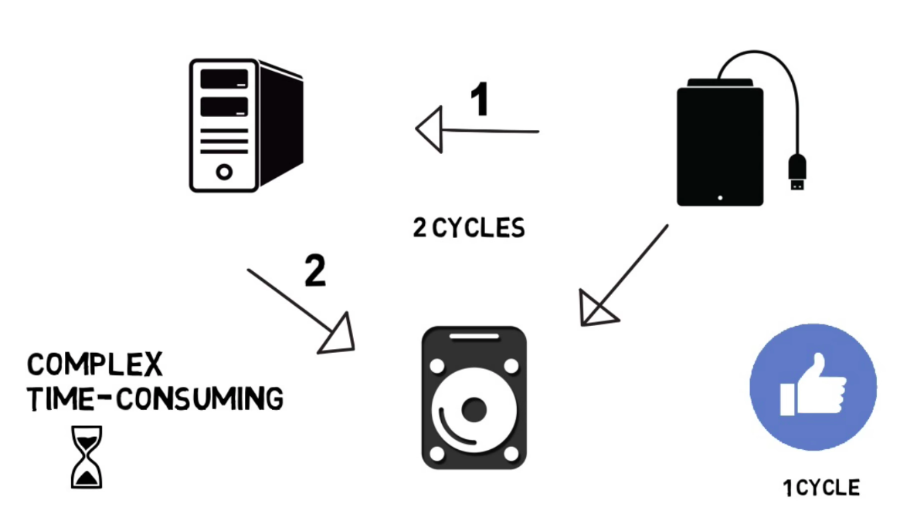
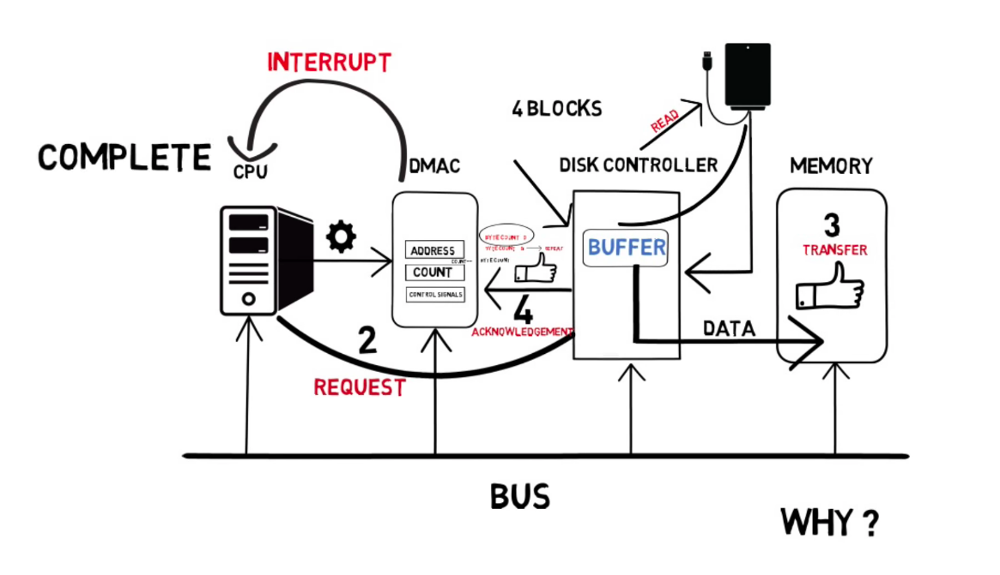
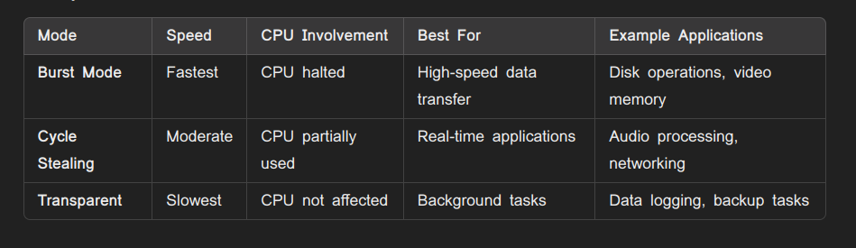

## Direct Memory Acces
* We know that for data transmission between memory and I/O device need an involvement of CPU , So that it slow down the process , To avoid this we have DMA which allows I/O devices to transfer data directly to memory without the invlovement of CPU , So that it speed the process like CPU focus do the other tasks .        
* It is a operation which the data is transfer from one resourcce to another without the help of CPU
* eg: data from usb to computer
* With the invlovement of CPU , it takes 2 cycle to do the proces while with DMA , 1 cycle is enough

## Working
* It contains 4 blocks
    * CPU
    * DMAC
    * Disk Controller (HDD,SSD)
    * Memory (RAM, cache,flash)
* First The CPU configures the DMA controller by providing
    * Source Address (where to read data eg.disk buffer)
    * Destination Address (where to write data eg.memory)
    * Count : Byte count
    * Control signal : read/write , burst , cycle stealing
    * After dont this the CPU hand over the process to the DMA for data process
* Then DMAC interacts with Disk controller to move the data into memory through internal buffer
* Buffer : It is a temporary storage area where the data is stored , the reason we are using buffer is dma cannot perform its operation unless theer is data inside a buffer to transfer the data which is in buffer and stored
* Once the first set of dat ais transfered , disk controller acknowledge the DMAC and reduce the count (Byte count)
* It will repeat the same process until the cout become 0
* Then the DMA controller request the disk controller
* Once it become 0 , DMAC sends an interrupt to CPU that it  finish the data transfer
* So CPU involve only 2 times (to configure and get interrupt)

## Modes of DMA
* Burst mode : 
    * The DMA controller transfers an entire block of data at once before releasing control of the system bus back to the CPU. The CPU is halted during the transfer.
    * The CPU initiates the transfer and hands control to the DMA controller.
    * DMA transfers a block of data in one go.
    * Once completed, the CPU regains access to the bus.
* Cycle stealing mode
    * DMA controller transfers one word (or byte) of data at a time and then releases the bus back to the CPU. This allows the CPU to operate intermittently between data transfers.
    * DMA requests bus access and transfers a single word/byte of data.
    * The CPU resumes execution after each transfer.
    * This continues until the entire transfer is complete
* Transparent mode
    * In transparent mode, the DMA controller only transfers data when the CPU is not using the system bus. This mode does not interfere with CPU operations, making it the least intrusive mode.
    * DMA waits for idle cycles when the CPU is not using the bus.
    * Transfers data without interrupting CPU tasks.
    * Continues until the transfer is complete.

* Back to [UDMA](../UDMA/udma.md)

* Go though the mm8a Makefile script and main thing in
* KT
* TDA 4VM processor  