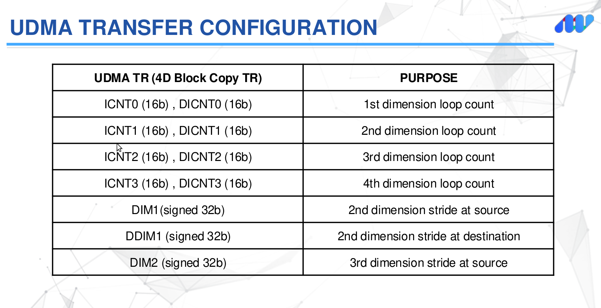
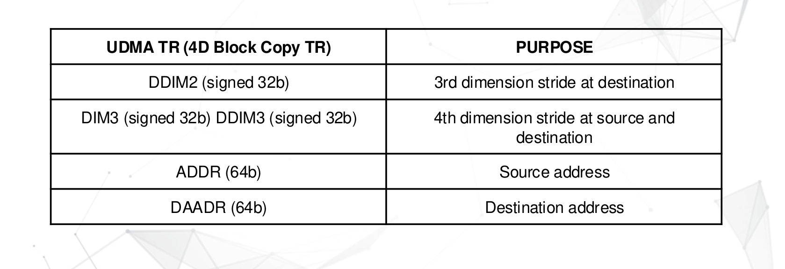
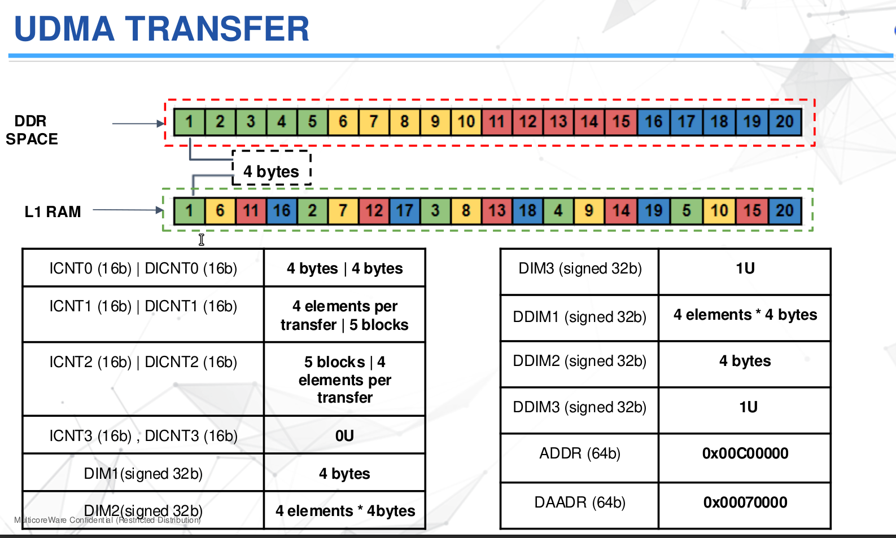

## Prerequisites
* DMA : [Click Here](./DMA/dma.md)

## Resources
* UDMA 1 : [Click Here](./UDMA1.pdf)
* UDMA 2 : [Click Here](./UDMA2.pdf) 

# Unified Data Memory Access
* It is an advancement of DMA that handle the packet based data
* Here the data is segmented and then reassembled
* By sending the data in smaller packet we can do the e=data trnansfer faster which each packet is travel in different path 
* UDMA is used for devices that need data in smaller, well-organized chunks (like Ethernet cards or audio/video devices).
* If any of the packet is lost then we can resend it 
* DMA have one or two channels so there will be one or two transfer occur at a time
* But UDMA have multiple TX and RX channel , so the data transfer happen concurrently and improve efficiency
* DMA does not focus to track the individual data transfer , its main intention to finish the transfer as soon as possible , UDMA tracks the stae of each channel and packet
* DMA eg : Transfer data from sensor to memory
* UDMA  eg : ethernet , audio/video streaming and networking

## Descriptor
* The descriptor is basically like a blue print (instruction sheet) . It is the datastructure in the memory and tell the UDMA that where,how ,what to do with data
* Once the descriptor is created , then the isntruction is stored in the ring (Cirular queue) which is kike a task queue
* And DMA uses the simple control registor that contains (source, dest address, direction and transfer type) 
* UDMA contains some complesx like packet structure, segmentation, and reassembly.
### Types
    * Host Packet Descriptor
    * Transfer Request Descriptor 
1. Host packet Descripptor : 
    * It is is used to send the data packet in a single dimension and it is used for sending or receiving the data with peripheral (sensor) and memory to memory transfer
1. Transfer Request Descriptor : 
    * It can be used upto 4D data buffer and used for send the compex or multidimensional data like image frame , 3D models

## UTC (Unified Transfer Controller)
* UDMA is mainly designed for straightforware memory->memory,memory->IO,IO->memory , IT efficientlly send the data in a simpler manner and linera patterns like block of memory from one location to another
* Then some of the trnasfer contains some complex data like multidimensional array , nested loop , non contiguous memory regions . So to handle is we have UTC which handle upto 4D nested loops of data transfer
* UTC always act as a 3rd party DMA which it gets the transfer request and give the tranfer response
* The UTC receive the transfer request from UDMA through an interface caalled PSI-L (communncation protocol)
* After UTC successfully completes a data transfer it send a Transfer response to the UDMA
* UTC 
    * Cant hold data
    * Act as a intermediate
    * Do the complex operations 
    * Have 4 dimensional loop
* Advantage
    * Handle complex operation
    * Scalability and flexibility
    * Improve system performance
* Disadvantage
    * Hardware complexity
    * Cost
* The work of the UDMA is to move the data from one place to another
* For data manipuation we use UTC

## Transfer Synchronization
* The transfer in UDMa is occur upto 4D and it can be come under transfer synchronization
The sequence of operations that can be instructed includes up to 
1. DIM0 synchronized transfer: 1D - For Linear Transfer eg:copying row of pixel from source to destination
1. DIM1 synchronized transfer: 2D - Row and Column Transfer eg: Copying an entire image row by row
1. DIM2 synchronized transfer: 3D - Multi Layer Transfer (multiple image frame or layer) eg : copying multiple frame of the video
1. DIM3 synchronized transfer: 4D - Complex Multidimentional Transfer eg: Copying data across multiple video streams
* A descriptor (a configuration structure) specifies the data arrangement.
* The UTC engine reads the descriptor and organizes the data transfer based on the nested loop configuration.

## Configurations

## Example

## Example usage of UDMA
* We are in video processing system that handle the high spped video from I/O device like camera and we need to process that memory in real time . That system need to capture large block of data from the camera and process tham and store in the memory and all these need to do without affecting the CPU
* Here the UDMA is responsible for transfering the data from camera buffer to the memory , it is done by creating the transfer request.
* The advantage od UDMa is handling the multiple transfer like different video stream and multiple cameras are involved we can process this
* The UDMA's job is to coordinate the transfer but not to handle any intricate details about where the data should go or how it’s structured for that only we use UTC.
* UTC is a third-party DMA engine within the UDMA framework that manages complex data movements based on transfer requests.
